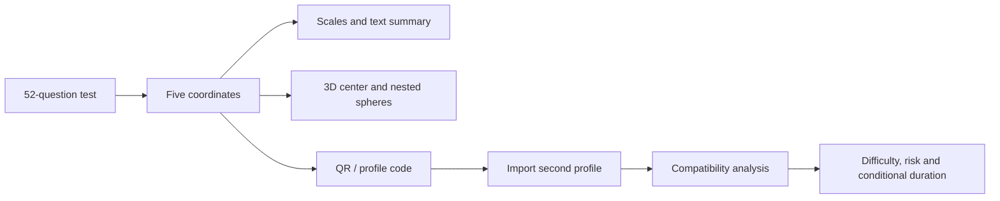

<div align="center">

# P5D Compatibility Template

**Адаптивный двуязычный шаблон теста личности, 3D-визуализации и сравнения совместимости**

`RU / EN` · `Three.js` · `QR` · `Mobile-first` · `No build step`

</div>

---

## О проекте

P5D Compatibility Template — клиентский прототип, который проводит пользователя через полный сценарий:

1. тестирование по пяти параметрам;
2. построение личного профиля;
3. отображение координат, шкал, текстовой интерпретации и 3D-модели;
4. формирование QR-кода и текстового кода профиля;
5. импорт второго профиля вручную, через изображение QR или камеру;
6. расчёт совместимости, сложности, риск-слоя и условного срока.

Проект работает без backend и без сборщика. Его можно разместить на GitHub Pages как обычный статический сайт.

> **Важно:** модель, вопросы и формулы являются экспериментальными. Это не диагностический психологический тест и не инструмент для медицинских, клинических или жизненно важных решений.

## Возможности

- 52 вопроса: 48 расчётных и 4 контрольных;
- 7 вариантов ответа;
- пять итоговых параметров в диапазоне `−50…+50`;
- русский и английский интерфейс;
- мобильная адаптивная вёрстка;
- сохранение прогресса в `localStorage`;
- 3D-визуализация через Three.js;
- внешняя сфера полного диапазона адаптации;
- внутренняя сфера безопасного диапазона;
- QR-код профиля без имени и отдельных ответов;
- ручной ввод, загрузка изображения и сканирование QR камерой;
- расчёт совместимости, сложности и диагностических сценариев;
- импортируемый банк вопросов в JSON.

## Быстрый запуск

ES-модули и загрузка JSON требуют HTTP-сервер. Не открывайте `index.html` через `file://`.

### Python

```bash
python -m http.server 8000
```

Откройте:

```text
http://localhost:8000
```

### Node.js

```bash
npx serve .
```

## Публикация на GitHub Pages

1. Создайте новый репозиторий.
2. Загрузите содержимое архива в корень репозитория.
3. Откройте **Settings → Pages**.
4. В разделе **Build and deployment** выберите **Deploy from a branch**.
5. Выберите ветку `main` и каталог `/root`.
6. Сохраните настройки.

Файл `.nojekyll` уже добавлен.

## Структура

```text
p5d-compatibility-template/
├── index.html
├── README.md
├── .gitignore
├── .nojekyll
├── assets/
│   ├── css/
│   │   └── main.css
│   └── js/
│       ├── app.js
│       ├── config.js
│       ├── i18n.js
│       └── scene.js
├── data/
│   └── questions.json
└── docs/
    ├── MODEL.md
    └── QUESTIONNAIRE.md
```



## Пять параметров

| Параметр | Отрицательный полюс | Положительный полюс | Визуализация |
|---|---|---|---|
| `X` | интроверсия | экстраверсия | координата X |
| `Y` | чувствительность | эмоциональная стабильность | координата Y |
| `Z` | прагматизм | абстрактность | координата Z |
| `T` | ригидность | ролевая гибкость | внешний радиус |
| `C` | самоотрицание при адаптации | аутентичный свободный выбор | доля безопасного радиуса |

Радиусы вычисляются так:

```text
R4 = T + 50
R5 = R4 × (C + 50) / 100
RiskLayer = R4 − R5
```

Подробнее: [`docs/MODEL.md`](docs/MODEL.md).

## Формат профиля

```text
P5D1|X|Y|Z|T|C
```

Пример:

```text
P5D1|20|-15|30|25|-10
```

QR содержит только версию формата и пять итоговых координат. Имя и ответы пользователя не включаются.

## Редактирование вопросов

Банк находится в [`data/questions.json`](data/questions.json).

```json
{
  "id": "X01",
  "axis": "x",
  "reverse": false,
  "kind": "score",
  "ru": "Текст вопроса",
  "en": "Question text"
}
```

Поля:

- `axis`: `x`, `y`, `z`, `t`, `c`;
- `reverse`: инвертировать направление оценки;
- `kind`: `score` или контрольный тип;
- `ru`, `en`: локализованные формулировки.

Подробнее: [`docs/QUESTIONNAIRE.md`](docs/QUESTIONNAIRE.md).

## Зависимости

Загружаются с CDN:

- Three.js `0.160.0`;
- QRCode.js `1.0.0`;
- html5-qrcode `2.3.8`.

Для полностью автономной версии скачайте библиотеки локально и замените URL в `index.html`.

## Ограничения прототипа

- вопросы и веса ещё не прошли психометрическую валидацию;
- формулы совместимости являются концептуальными;
- условный срок не является календарным прогнозом;
- камера обычно доступна только через HTTPS или `localhost`;
- данные сохраняются локально в браузере и не синхронизируются между устройствами;
- профильный код не подписан криптографически и может быть изменён вручную.

## Следующие этапы

- пилотное тестирование банка вопросов;
- анализ надёжности и факторной структуры;
- версия формата `P5D2` с контрольной суммой;
- локальные зависимости без CDN;
- экспорт результата в изображение или PDF;
- опциональный backend и аккаунты;
- история сравнений;
- доступность клавиатурой и расширенная поддержка screen reader.

## Лицензия

Лицензия намеренно не включена. Перед публикацией выберите условия использования, подходящие для проекта. Без файла лицензии стандартное авторское право сохраняется за владельцем репозитория.
